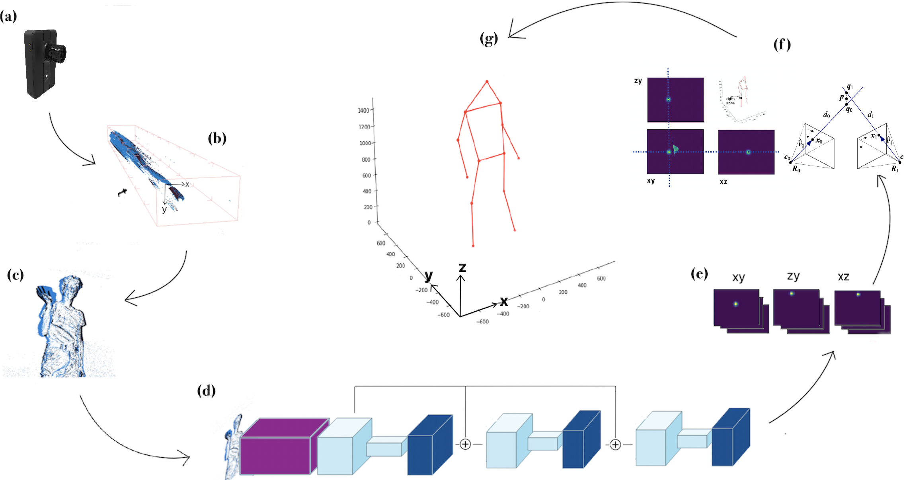
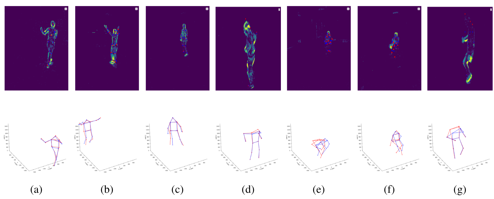

# Lifting Monocular Events to 3D Human Poses
[](https://travis-ci.com/gianscarpe/event-based-monocular-hpe)
[](https://event-camera.readthedocs.io/en/latest/?badge=latest)
[](https://coveralls.io/github/gianscarpe/event-based-monocular-hpe?branch=master)

[Gianluca Scarpellini](https://scarpellini.dev/) [Pietro Morerio](https://scholar.google.com/citations?user=lPV9rbkAAAAJ&hl=it&oi=ao) [Alessio Del Bue](https://scholar.google.com/citations?user=LUzvbGIAAAAJ&hl=it&oi=ao)



## Table of contents
- [Method](#Method)
- [Results](#Results)
- [References](#References)

## Abstract
This paper presents a novel 3D human pose estimation approach using a single
stream of asynchronous events as input. Most of the state-of-the-art approaches
solve this task with RGB cameras, which suffer when the subjects are moving
fast. On the other hand, event-based 3D pose estimation benefits from the
advantages of event-cameras, especially their efficiency and robustness to
appearance changes. Yet, finding human poses in asynchronous events is in
general more challenging than standard RGB pose estimation, since little or no
events are triggered in static scenes. Here we propose the first learning-based
method for 3D human pose from a single stream of events. Our method consists of
two steps. First, we process the event-camera stream to predict three orthogonal
heatmaps per joint; each heatmap is the projection of of the joint onto one
orthogonal plane. Next, we fuse the sets of heatmaps to estimate 3D localisation
of the body joints. As a further contribution, we make available a new,
challenging dataset for event-based human pose estimation by simulating events
from the RGB Human3.6m dataset. Experiments demonstrate that our method
achieves state-of-the-art accuracy, narrowing the performance gap between
standard RGB and event-based vision.

- [Code](https://github.com/IIT-PAVIS/lifting_events_to_3d_hpe)
- [Technical documentation](https://event-camera.readthedocs.io/en/latest)
- [Paper (coming soon)]()

## Event-Human3.6m
The generation pipeline details and code are released at [https://github.com/IIT-PAVIS/lifting_events_to_3d_hpe/tree/master/scripts/h3m](https://github.com/IIT-PAVIS/lifting_events_to_3d_hpe/tree/master/scripts/h3m).


## Results


## BibTex Citation
```
 @inproceedings{gscarpellini2021,
}
```

## References
<a id="1">[1]</a> Falcon, WA and .al (2019). PyTorch Lightning GitHub. Note:
https://github.com/PyTorchLightning/pytorch-lightning

<a id="2">[2]</a> Gallego, Guillermo, Tobi Delbruck, Garrick Michael Orchard, Chiara Bartolozzi, Brian Taba, Andrea Censi, Stefan Leutenegger, et al. 2020. “Event-Based Vision: A Survey.” _IEEE Transactions on Pattern Analysis and Machine Intelligence_. Institute of Electrical and Electronics Engineers (IEEE), 1. <http://dx.doi.org/10.1109/TPAMI.2020.3008413>
